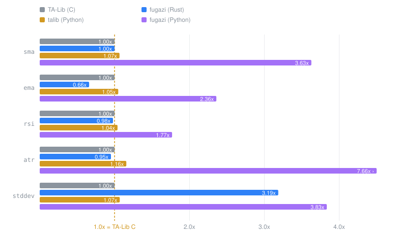

# fugazi

[](https://github.com/acpuchades/fugazi/actions/workflows/ci.yml)
[](https://crates.io/crates/fugazi)
[](https://docs.rs/fugazi)
[](https://pypi.org/project/fugazi/)
[](LICENSE)
[](https://github.com/sponsors/acpuchades)

**One trading engine for research and production.** fugazi is a Rust library of
incremental technical-analysis primitives, a strategy layer, and a backtester —
where the code that backtests is *literally* the code that trades live. Every
indicator owns its state and advances one sample at a time in ~O(1), so there is
no vectorised research path and separate streaming path to keep in sync.

```rust,ignore
let report = run(&mut strategy, &mut PaperWallet::new(10_000.0), snapshots);
//                                   ^^^^^^^^^^^^^^^^^^^^^^^^^^ backtest
let report = run(&mut strategy, &mut OkxWallet::mainnet(k, s, p), snapshots);
//                                   ^^^^^^^^^^^^^^^^^^^^^^^^^^^ live — same strategy
```

That is the whole pitch. The rest of this page is the evidence, then the manual.

**Jump to:** [Why](#why-fugazi) · [Install](#install) · [Sixty seconds](#sixty-seconds) ·
[Rust guide](#guide-the-rust-library) · [CLI guide](#guide-the-command-line) ·
[Python](#python) · [Performance](#performance) · [What's included](#whats-included) ·
[Sponsor](#sponsor)

---

## Why fugazi

### The seam that usually breaks

Most quant stacks are two programs wearing one name. Research is vectorised —
whole arrays, whole history, one C loop. Production is event-driven — one bar
arrives, you react. They are written differently, they drift, and the bugs that
result are the expensive kind: the backtest nobody can reproduce live.

fugazi removes the seam by making the *incremental* form the only form, then
making it fast enough that you don't miss the vectorised one.

| What you need | The usual answer | What that costs | fugazi |
| --- | --- | --- | --- |
| Fast indicators | TA-Lib, pandas-ta | Array-at-a-time. A live bar means recomputing the array, or writing a second implementation you now maintain twice | One `update()` per bar, [at or below TA-Lib C speed](#performance) on `sma`/`ema`/`rsi`/`atr`/`macd` |
| A backtest | vectorbt, backtesting.py | A fill model expressed as array masks; the loop that trades live is a different program | [`backtest::run`](#backtest--metrics) takes any `impl Wallet` — paper or venue |
| Live execution | A broker SDK plus glue | The strategy gets rewritten against the SDK's callbacks | `Wallet` is a trait. [Swap the wallet](#live-trading), keep the strategy |
| Several symbols per bar | A DataFrame per symbol, then a join | Joining on the trading *date* manufactures cross-timezone lookahead | [`Snapshot<Sym>`](#cross-asset-composition) *is* the bar; `Pick` projects one asset out |
| Non-price inputs | Bolt on a column, hope | No types, no warm-up accounting | [Overlays](#overlays--non-price-columns): typed `!get` readers over any joined series |
| A parameter sweep | A `for` loop | Single-threaded, and it overfits quietly | [`optimize -j`](#optimize--parameter-sweeps) with walk-forward, windowed ranking, risk aversion |

### The case, in eight points

**1. One engine, research to production.** `backtest::run` is generic over
`Wallet`, so the same strategy value drives an in-memory `PaperWallet`, an
`OkxWallet` (OKX perpetual swaps), a `CoinbaseWallet` (Advanced Trade spot) or a
`KrakenWallet` (Kraken spot).
It isn't a backtest function that *also* happens to work live — that's why it is
called `run`. A whole `Portfolio` runs the same way.

**2. Incremental costs nothing.** The usual objection to per-bar dispatch is
speed. Measured against TA-Lib's C library over 200 000 samples, fugazi is at
parity or faster on `sma` (1.01×), `rsi` (0.99×), `atr` (0.95×), `ema` (0.69×)
and `macd` (**0.12×**) — while staying one bar at a time. A full backtest
performs **29 allocations in total**, not per bar, and that ceiling is enforced by
a test (`tests/perf_guard.rs`), not asserted in prose.
[Full numbers, and the two places it loses →](#performance)

**3. Composition is construction.** No pipe operator, no `Chain` builder, no DSL
to learn. An indicator owns its source, so "EMA-20 of the SMA-10 of the close" is
exactly `Ema::new(Sma::new(Current::close(), 10), 20)` — one value, one trait, and
a `warm_up_bars()` computed correctly across the entire nested chain.

**4. Multi-symbol and non-price data are first-class.** The unit of input is a
`Snapshot<Sym>`: every symbol's bar for that timestamp, each optionally carrying
an *overlay* bundle (funding rate, open interest, market cap, a regime label, your
own precomputed signal). Cross-asset expressions are ordinary indicators —
`Close::of(Pick::matching(by_symbol("BTC"))).sub(…)` is a spread you can hand to
anything that takes a source.

**5. Parallelism where it pays.** Enable `parallel` for
[`backtest::run_many`](#running-an-ensemble-in-parallel), a rayon fan-out over
`(strategy, wallet)` pairs sharing one snapshot stream — for ensembles, seed
sweeps and scenario grids. The CLI's `optimize` spreads its grid over a pool sized
by `-j/--jobs`, and the Monte Carlo permutation pass parallelises too. Per-bar
state stays single-threaded and cache-resident, which is where the throughput
comes from; the parallelism sits one level up, where runs are genuinely
independent.

**6. Five strategy shapes, in Rust *or* YAML, over one engine.** Single asset,
pairs, cross-sectional basket, per-symbol multi-asset, and a portfolio of N
different strategies netting onto one account. The YAML surface is not a
reimplementation — it builds the same types, so `fugazi run @strategy.yml` and a
hand-written Rust strategy execute identical code.

**7. Unsettled numbers are refused by default.** Every indicator reports
`warm_up_bars()` *and* `unstable_bars()` — the extra samples until an IIR seed's
influence has decayed below 0.1%. A strategy will not trade until every wired
signal and every protective level is past both, so no trade fires on a
seed-contaminated value. There is exactly one opt-out, `!unstable` / `.unstable()`.
[Why this shape →](#safe-defaults-opt-in-overrides)

**8. Checked against four reference libraries, not just against itself.**
Indicators are cross-validated against **TA-Lib**, equity-curve metrics against
**empyrical**, wallet execution against **vectorbt**, and trade statistics against
**backtesting.py**. Fixtures are committed and CI runs with
`FUGAZI_REQUIRE_FIXTURES=1`, so a stale fixture fails the build instead of
silently comparing nothing. Where fugazi deliberately *disagrees* with a reference
— five of backtesting.py's headline stats answer a different question from the
field sharing their name — the divergence itself is asserted, so a library that
changes convention breaks the generator rather than quietly re-baselining.

### When fugazi is the wrong tool

Worth saying plainly, so you don't find out in week three:

- **You want plots.** It writes CSV and YAML, nothing else. Plotting is post-hoc —
  [there's an R recipe below](#analyzing-a-run).
- **You need tick data or L2 microstructure.** The unit of time is a bar.
- **You want a hosted order-management system.** Three venue wallets ship (OKX
  swaps, Coinbase spot, Kraken spot); anything else is a `Wallet` impl you write.
- **Your hot path is `stddev` on huge windows.** fugazi's is ~3.5× TA-Lib's, on
  purpose — [the shortcut it refuses](#performance) returns exactly `0.0` for 896
  of 4 981 windows on the benchmark series.

---

## Install

**Rust library**

```toml
[dependencies]
fugazi = "0.91"
```

**Command-line backtester**

```sh
cargo install fugazi          # provides the `fugazi` binary
```

**Python**

```sh
pip install fugazi            # prebuilt wheels for Linux, macOS, Windows
```

### Features

| Feature | Default | What it adds |
| --- | :---: | --- |
| `sources` | ✅ | Remote data providers (Binance, Binance Vision, OKX, Kraken, Coinbase, Yahoo, CoinGecko) |
| `cli` | ✅ | The `fugazi` binary; implies `sources`, `runtime`, `montecarlo`, `parallel` |
| `runtime` | ✅ | The type-erasure vocabulary the YAML and Python layers build on |
| `parallel` | — | `backtest::run_many`, the rayon ensemble driver |
| `montecarlo` | — | Bootstrap resampling and empirical-null p-values (the only use of `rand`) |
| `live` | — | `OkxWallet`, `CoinbaseWallet` and `KrakenWallet` — real order routing |

Want the library alone? `default-features = false` leaves `serde`, `time`,
`statrs` and the internal derive macro.

---

## Sixty seconds

Three snippets, each a step further than the last.

**A signal.** Define it once; feed it one bar at a time.

```rust,no_run
use fugazi::prelude::*;
use fugazi::indicators::{Current, Ema, Rsi};
use fugazi::sources::{Binance, SeriesSource, Interval, Timestamp};

# async fn demo() -> Result<(), fugazi::sources::SourceError> {
// "close crosses above its EMA-20, while RSI-14 is still under 70" — one object.
let mut entry = Current::close()
    .crosses_above(Ema::new(Current::close(), 20))
    .and(Rsi::new(Current::close(), 14).below(70.0));

let feed: Vec<Candle> = Binance::new()
    .atoms("BTCUSDT", Interval::Day(1), Timestamp(1_704_067_200_000), None)
    .await?
    .into_iter()
    .filter_map(|a| a.candle)
    .collect();

for candle in feed {
    entry.update(candle.into());
    if entry.is_true() { /* fire */ }
}
# Ok(()) }
```

**A backtest.** Take a strategy off the shelf, hand it a wallet, read the metrics.

```rust,no_run
use fugazi::prelude::*;
use fugazi::backtest::run;
use fugazi::metrics::{per_bar_returns, sharpe};
use fugazi::sources::{Yahoo, SeriesSource, Interval, Timestamp};
use fugazi::{strategies::trend, Snapshot};

# async fn demo() -> Result<(), fugazi::sources::SourceError> {
let candles: Vec<Candle> = Yahoo::new()
    .atoms("AAPL", Interval::Day(1), Timestamp(1_704_067_200_000), None)
    .await?
    .into_iter()
    .filter_map(|a| a.candle)
    .collect();

let mut strategy = trend::ma_crossover("AAPL", 10, 30);
let mut wallet = PaperWallet::new(10_000.0);

let report = run(
    &mut strategy,
    &mut wallet,
    candles.into_iter().map(|c| Snapshot::single("AAPL", c.into())),
);

let returns = per_bar_returns(&report.equity_curve, report.initial_equity);
println!("sharpe: {:?}", sharpe(&returns, 0.0, 252.0));
# Ok(()) }
```

**Live.** The same call against a real venue. One type changed.

```rust,ignore
use fugazi::live::OkxWallet;

let mut wallet = OkxWallet::demo(key, secret, passphrase);   // or ::mainnet(..)
let report = run(&mut strategy, &mut wallet, live_snapshots);
```

Rather not write Rust at all? The same strategy as a one-liner:

```sh
fugazi run '{ root: AAPL, long: { enter: !crosses_above {
    lhs: !sma { period: 10 }, rhs: !sma { period: 30 } } } }' \
  --series symbol=AAPL,@candles.csv --output-dir out/
```

---

## Guide: the Rust library

### The three layers

- **Indicators** are the numeric sources. Each produces a `Real` (`f64`) and
  **owns its own input source**, so composition is nesting constructors:
  `Ema::new(Current::close(), 20)` is the EMA-20 of the close. Leaves terminate
  the chain — `Identity` (a raw value stream), `Value` (a constant), and the
  candle accessors under `Current`. Bar indicators (`Atr`, `Adx`, `Obv`, …) read
  the whole bar, so they take a `Candle`-output source: `Atr::new(Current::candle(), 14)`.
- **Signals** are composable booleans: `Indicator<Output = bool>`. A comparison is
  built from two sources, so "RSI over 70" is a single object. Combine with
  `and` / `or` / `xor` / `not` / `changed`.
- **Strategies** are the decision layer. A strategy reads the input each bar,
  advances its signals, and opens or closes positions on a `Wallet` it is handed.

The first two layers are *pure* value producers sharing one shape: state lives
inside, `update(input)` advances one step, and output is `None` until warmed up.
Every indicator is fed one `Atom` per bar (`Atom { candle, overlays }`); a bare
`Candle` lifts via `From<Candle> for Atom`, so `signal.update(candle.into())` is
the streaming pattern.

Working on a bare `f64` price stream instead of candles? `Identity` passes raw
values straight through: `Rsi::new(Identity::new(), 14)`.

### Composition

Indicators nest — composition *is* construction:

```rust
use fugazi::indicators::{Current, Ema, Sma};

let _ema_of_sma = Ema::new(Sma::new(Current::close(), 10), 20); // EMA of an SMA
```

`IndicatorExt` turns sources into other sources and into signals:

```rust
use fugazi::prelude::*;
use fugazi::indicators::{Current, Ema};

// arithmetic over two sources, and lookback ops (lag / diff / ratio)
let _spread   = Ema::new(Current::close(), 10).sub(Ema::new(Current::close(), 30));
let _momentum = Current::close().diff(1);          // x[t] - x[t-1]
let _change   = Current::close().ratio(1);         // x[t] / x[t-1]

// comparisons (tolerance-aware) -> signals
let _above = Current::close().gt(Ema::new(Current::close(), 50));
let _cross = Ema::new(Current::close(), 10).crosses_above(Ema::new(Current::close(), 30));
```

`BoolIndicatorExt` composes signals:

```rust
use fugazi::prelude::*;
use fugazi::indicators::{Current, Ema, Rsi};

let _entry = Current::close()
    .crosses_above(Ema::new(Current::close(), 20))
    .and(Rsi::new(Current::close(), 14).below(70.0));
```

A *crossover* is not a special type — it is "the comparison is true **and** it just
changed", i.e. `a.gt(b).and(a.gt(b).changed())`, which `crosses_above` builds for
you. `changed()` is the single edge primitive; it fires on any toggle.

Comparisons are tolerance-aware, so floating-point noise doesn't cause spurious
flips. The default band is **scale-aware** — `max(1e-12, 1e-9 · larger operand)` —
because operands range from per-bar returns to five-figure prices and no single
absolute number is right for both. Override with `Gt::with_epsilon(a, b, eps)` for
a literal deadband in the operands' own units, or `Gt::with_tolerance(a, b, t)`.

### Multi-output indicators

`Macd`, `Bollinger`, `Adx` and friends produce a small value struct, but each
output also has a **component accessor** projecting that one field back into an
ordinary `Indicator<Output = Real>` — so a single line composes and compares like
any other source:

```rust
use fugazi::prelude::*;
use fugazi::indicators::{Bollinger, Current, Macd};

// MACD line crossing its signal line, as one composed Signal:
let macd = Macd::new(Current::close(), 12, 26, 9);
let _macd_cross = macd.line().crosses_above(macd.signal());

// "close pierces the upper Bollinger band":
let bands = Bollinger::new(Current::close(), 20, 2.0);
let _breakout = Current::close().gt(bands.upper());
```

Each accessor clones its source, so those operands are independent instances —
feed each the same `Candle` per bar.

#### Sharing one instance across many accessors

Two accessors on the same `Bollinger` mean two full copies running independently.
Cheap alone, but a crossover clones its operands, and a strategy with
`long_on(up, down)` and `short_on(down, up)` ends up running the same multi-output
indicator 8 or 16 times per bar. When the accessors all target one instance, wrap
it with `.shared()`:

```rust
use fugazi::prelude::*;
use fugazi::indicators::{Current, Macd};

// One MACD, driven exactly once per bar however many accessors read out of it.
let macd = Macd::new(Current::close(), 12, 26, 9).shared();
let up = || macd.line().crosses_above(macd.signal());
let down = || macd.line().crosses_below(macd.signal());
```

Each accessor returns a `SharedComponent` borrowing the same source through an
`Rc<RefCell<_>>`; whichever is updated first each bar drives the underlying MACD
and the rest read cached outputs. Behaviour is identical to the independent-clones
form (asserted bit-for-bit in tests); only the per-bar cost drops. The classical
strategies (`macd_crossover`, `donchian_breakout`, `bollinger_breakout`,
`bollinger_reversion`, `keltner_breakout`) opt in by default, and any new strategy
stacking several accessors on one indicator should too.

### Cross-timeframe composition

Two primitives compose to run an indicator on candles **coarser** than the base
stream — no dedicated wrapper. `Resample<S>` buckets `every` base candles into one
higher-timeframe `Candle` (emitting `Some` only on the completing tick), and
`Latch<S>` re-emits the last `Some` on `None` ticks so a per-tick consumer sees the
finished value between boundaries.

```rust
use fugazi::prelude::*;
use fugazi::indicators::{Current, Ema, Latch, Resample};

// "base close crosses above an EMA-20 computed on 4-bar candles."
let _sig = Current::close().crosses_above(
    Latch::new(Ema::new(Resample::new(Current::candle(), 4).close(), 20)),
);
```

The **only correct ordering** is Resample → recursive smoother → Latch. Latching
*before* an EMA / RSI / ATR would feed it a repeated value on every base tick,
distorting the recurrence. Warm-up and unstable periods pass through as raw
composition arithmetic (in higher-timeframe sample counts, not base-bar scaled), so
a strategy needing base-bar-correct stability accounting must feed enough leading
history for the recursive tail to decay in HTF terms.

### Cross-asset composition

For strategies reasoning about more than one instrument per bar, feed a
**`Snapshot<Sym>`** — a series of `(Option<Sym>, Option<StreamId>, Atom)` entries
— and use `Pick<Sym, S>` to project one asset out. Every atom-input leaf composes
on top verbatim through its `T::of(source)` constructor:

```rust
use fugazi::prelude::*;
use fugazi::indicators::{Close, Pick};
use fugazi::{Frequency, Selector, Snapshot};

// The BTC/ETH close spread as a first-class Real-output indicator. Two
// symbol-matching `Pick`s plus arithmetic — no per-strategy machinery.
let mut spread = Close::of(Pick::<String>::matching(Selector::by_symbol("BTC")))
    .sub(Close::of(Pick::<String>::matching(Selector::by_symbol("ETH"))));

let mut snap = Snapshot::<String>::new();
snap.push(Some("BTC".into()), None, Atom::new(Candle::new(100.0, 101.0, 99.0, 100.0, 1.0)));
snap.push(Some("ETH".into()), None, Atom::new(Candle::new(60.0,  61.0, 59.0, 60.0,  1.0)));
assert_eq!(spread.update(snap), Some(40.0));
```

`Selector<Sym>` is a **partial-key predicate**, not a snapshot key:
`by_symbol("BTC")` matches every BTC entry regardless of stream,
`by_stream("1h")` matches every hourly entry regardless of symbol, and
`exact("BTC", Frequency::Hour(1))` matches a single tagged entry. A `StreamId`
is an opaque label — a `Frequency` converts into one, so a cadence is the usual
spelling, but a price-less or activity-sampled series can carry any id. The empty
selector (`Selector::default()`) is the "no query" sentinel — `Pick::new()` uses it
to trigger `Snapshot::sole_atom_or_panic`, so a strategy authored around cross-asset
primitives still runs cleanly on a single-series driver feeding size-1 snapshots.

### Overlays — non-price columns

An `Atom` is a `Candle` **plus an optional overlay bundle**, which is how non-price
data enters the same expression tree: funding rate, open interest, market cap, a
fundamentals column, a regime label, or a signal you precomputed elsewhere. Read
one with the typed accessors `GetReal` / `GetBool` / `GetStr` — in YAML, `!get
{ key: funding_rate }` — and it composes exactly like a price source, warm-up
accounting included.

That means "trade the perp only while funding is negative" is a comparison against
an overlay, not a special case in your loop. On the CLI, `fugazi get -x` computes
overlay columns onto fetched bars, and `--series` full-outer-joins any extra CSV
onto the price frame. [Overlay columns on the CLI →](#get--data-and-overlays)

### Strategies

A **strategy** is *your own type* implementing the `Strategy` trait. The wallet —
not the strategy — owns the portfolio (funds, positions, a blotter), which is
precisely why the same strategy runs against `PaperWallet` or a live venue.

```rust
use fugazi::prelude::*;
use fugazi::indicators::{Close, Pick, Sma};
use fugazi::Snapshot;

// Own your signals; act on the wallet. `update` advances the signals; `trade`
// reads them and acts. `Size` is absolute units or a fraction of funds / equity /
// current position, and `Side` gives direction — so position sizing,
// short-selling and staying always-in-market are just what the code does.
struct GoldenCross {
    symbol: &'static str,
    enter: Box<dyn Signal<Snapshot<&'static str>>>,
    exit: Box<dyn Signal<Snapshot<&'static str>>>,
}

impl Strategy for GoldenCross {
    type Input = Snapshot<&'static str>;
    type Symbol = &'static str;

    fn update(&mut self, snap: Snapshot<&'static str>) {
        // Advance EVERY signal every bar — a skipped one desyncs from the feed.
        self.enter.update(snap.clone());
        self.exit.update(snap);
    }

    fn trade(&self, wallet: &mut dyn Wallet<&'static str>) {
        // The wallet is priced from outside; `trade` just reads signals and acts.
        if self.enter.is_true() {
            let _ = wallet.set(self.symbol, Side::Buy, Size::value_frac(1.0));
        } else if self.exit.is_true() {
            let _ = wallet.close(self.symbol);
        }
    }

    fn reset(&mut self) {
        self.enter.reset();
        self.exit.reset();
    }
}

let close = || Close::of(Pick::<&'static str>::new());
let mut strat = GoldenCross {
    symbol: "AAPL",
    enter: Box::new(Sma::new(close(), 3).crosses_above(Sma::new(close(), 10))),
    exit:  Box::new(Sma::new(close(), 3).crosses_below(Sma::new(close(), 10))),
};
let mut wallet = PaperWallet::new(10_000.0);

# let feed: Vec<Candle> = Vec::new();
for candle in feed {
    wallet.update("AAPL", candle);                          // price the wallet
    strat.update(Snapshot::of_atom(candle.into()));         // advance signals
    strat.trade(&mut wallet);                               // act
}
let _orders = wallet.orders();   // the blotter — recent fills, for reporting
```

`Input = Snapshot<Sym>` even for one symbol: a single-series driver feeds size-1
snapshots (`Snapshot::of_atom`) and the empty-selector `Pick::<Sym>::new()` inside
every leaf unpacks the sole atom.

The blotter is an observability accessor, not a ledger: it keeps the last
`wallet::DEFAULT_RETENTION` fills (opt out with `.with_retention(None)`) and is not
carried across a run-resume. Keep your own store if you need durable history.

#### You don't have to write one from scratch

The type above is what a `Strategy` *is*, and worth reading once — but five
ready-made shapes cover most of what people build, each configurable in Rust or
from a YAML file (see [docs/STRATEGIES.md](docs/STRATEGIES.md)):

| Type | Shape |
| --- | --- |
| [`SingleAssetStrategy`](https://docs.rs/fugazi/latest/fugazi/strategies/struct.SingleAssetStrategy.html) | long / flat / short on one symbol, from four signal slots plus protective levels |
| [`PairsStrategy`](https://docs.rs/fugazi/latest/fugazi/strategies/struct.PairsStrategy.html) | long / flat / short on the spread between two symbols |
| [`BasketStrategy`](https://docs.rs/fugazi/latest/fugazi/strategies/struct.BasketStrategy.html) | cross-sectional: score every symbol, long the top and short the bottom |
| [`MultiAssetStrategy`](https://docs.rs/fugazi/latest/fugazi/strategies/struct.MultiAssetStrategy.html) | the same rule applied independently to N symbols |
| [`Portfolio`](https://docs.rs/fugazi/latest/fugazi/portfolio/struct.Portfolio.html) | N *different* strategies sharing one account |

`fugazi::strategies` also carries a catalogue of named recipes built on the first
of these, grouped by family — `trend::ma_crossover`, `trend::donchian_breakout`,
`mean_reversion::rsi_reversal`, `momentum::*`, `volume::*`, `composite::*` — so the
common cases are one call.

`Portfolio` earns a paragraph, because it answers a question the others can't:
*what would these strategies have earned together?* It runs each child against its
own notional book while trading a **single account**, combining every child's
intent into one order per symbol. That is what a real deployment looks like, so the
same portfolio backtests and trades live:

```rust
use fugazi::portfolio::{Portfolio, policy::EqualWeight};
use fugazi::strategies::{mean_reversion, trend};

# fn snapshots() -> Vec<fugazi::Snapshot<&'static str>> { Vec::new() }
let mut portfolio: Portfolio<&'static str> = Portfolio::builder()
    .with_initial_equity(10_000.0)
    .add("trend", trend::ma_crossover("BTC", 10, 30))
    .add("revert", mean_reversion::rsi_reversal("ETH", 14, 30.0, 70.0))
    .weights(EqualWeight)
    .build();
let report = portfolio.run(snapshots());   // aggregate equity curve + blotter
# let _ = report.equity_curve;
```

Because children share a book, a few things follow — opposing flow crosses
internally, one child's stop only takes off its own share — all covered under
[How capital moves](docs/STRATEGIES.md#how-capital-moves).

### Working with the wallet

The wallet is fed each symbol's bar every tick via `wallet.update` (its `close`
marks to market, its `[low, high]` bounds fills). `set` targets an absolute
position — an opposite-side `set` reverses, `value_frac(1.0)` targets 1x equity — and
`close` flattens. Queries return unit-tagged amounts (`Reference` cash and equity,
`Units` of a symbol). For multi-asset strategies, feed the wallet each symbol's
price and act on more than one symbol per `trade`; see the `pairs` example.

Trading costs are the wallet's business too: `PaperWallet::with_costs` wires a
commission / spread / slippage bundle into every fill, and the CLI's `--costs`
exposes the same models. See [docs/COSTS.md](docs/COSTS.md), and
[docs/TRADING.md](docs/TRADING.md) for the full path from bar to closed trade —
including why nothing fills on the bar that caused it.

### Backtest & metrics

The per-bar loop above — price the wallet, `on_fill`, `update`, `trade`, record
equity — is what `fugazi::backtest::run` does for you. It takes any
`impl Wallet<Sym>`, so the same primitive drives a `PaperWallet` backtest or a live
broker unchanged (hence the neutral name), and returns a `RunReport` with the
equity curve and every booked `Fill`:

```rust
use fugazi::prelude::*;
use fugazi::backtest::run;
use fugazi::Snapshot;

# struct MyStrategy;
# impl Strategy for MyStrategy {
#     type Input = Snapshot<&'static str>;
#     type Symbol = &'static str;
#     fn update(&mut self, _: Snapshot<&'static str>) {}
#     fn trade(&self, _: &mut dyn Wallet<&'static str>) {}
#     fn reset(&mut self) {}
# }
# let mut strat = MyStrategy;
# let candles: Vec<Candle> = vec![];
let mut wallet = PaperWallet::new(10_000.0);
// `Snapshot::single(sym, atom)` tags the sole entry with the trading symbol so
// `run` can price the wallet each bar.
let snapshots = candles
    .into_iter()
    .map(|c| Snapshot::single("AAPL", c.into()));
let report = run(&mut strat, &mut wallet, snapshots);
// report.equity_curve : Vec<Real>    — one mark-to-market point per bar
// report.fills        : Vec<Fill<_>> — every booked order, bar-indexed
```

`fugazi::metrics` reduces that report to numbers **one function per metric** — no
aggregate `compute`. Three intermediate builders (`per_bar_returns`,
`reconstruct_trades`, `drawdown_segments`) turn the raw artefacts into the shapes
each metric family consumes; the metrics themselves are the classic catalogue
(`sharpe`, `sortino`, `calmar`, `omega`, `ulcer_index`, `max_drawdown`, `win_rate`,
`profit_factor`, `expectancy`, `value_at_risk` / `conditional_value_at_risk`,
`skewness`, `kurtosis`, …):

```rust
use fugazi::backtest::RunReport;
use fugazi::metrics::{per_bar_returns, drawdown_segments, sharpe, max_drawdown};

# let report: RunReport<&'static str> = RunReport {
#     equity_curve: vec![10_000.0, 10_100.0, 10_050.0],
#     fills: vec![],
#     rejections: vec![],
#     initial_equity: 10_000.0,
#     ruin_bar: None,
#     carry_coverage: None,
# };
let returns  = per_bar_returns(&report.equity_curve, report.initial_equity);
let segments = drawdown_segments(&report.equity_curve);

let _sharpe = sharpe(&returns, /*rf=*/ 0.0, /*bars_per_year=*/ 252.0);
let _max_dd = max_drawdown(&segments);
```

This is what the CLI backtester sits on: it drives `run`, then aggregates every
metric into a YAML report. See [docs/METRICS.md](docs/METRICS.md) for definitions.

### Running an ensemble in parallel

Enable the `parallel` feature and `backtest::run_many` fans a slice of
`(strategy, wallet)` pairs across a rayon pool against **one shared snapshot
stream** — parameter variants, seed sweeps, scenario grids, or an ensemble you
intend to vote:

```rust,ignore
use fugazi::backtest::run_many;

let mut runs: Vec<(_, PaperWallet<&str>)> = (5..25)
    .map(|fast| (trend::ma_crossover("BTC", fast, 50), PaperWallet::new(10_000.0)))
    .collect();

let reports = run_many(&mut runs, &snapshots);   // one RunReport per pair
```

Each run owns its strategy and its wallet, so there is nothing shared to
synchronise — the snapshots are read-only. Per-bar state stays single-threaded and
cache-resident on purpose; that's where the throughput comes from. Parallelism sits
here, one level up, where runs are genuinely independent.

The CLI applies the same idea: `optimize -j N` sizes the grid's thread pool, and
the Monte Carlo permutation pass parallelises its resamples.

### Safe defaults, opt-in overrides

Numbers produced during a source's warm-up or IIR settling tail are *unsettled*:
they exist, but their value depends on the seed, on the segment the window happens
to start on, or on both. Every knob that could paper over an unsettled bar is
biased toward **waiting**, with a single named opt-out.

- **Strategy readiness.** `SingleAssetStrategy::is_ready()` returns `true` only
  once `bars_seen` reaches the largest `stable_bars()` (`warm_up_bars() +
  unstable_bars()`) across every wired signal and every attached protective level,
  and `backtest::run` skips `trade()` until then. Wrap a subtree in
  [`Unstable`](https://docs.rs/fugazi/latest/fugazi/indicators/struct.Unstable.html)
  — `.unstable()` in Rust/Python, `!unstable { source }` in
  YAML — to zero its reported `unstable_bars()` and skip the wait for its IIR tail.
  `update()` and `on_fill()` still run every bar so warm-up progresses.
- **`fugazi get` overlays.** The CLI trims each column's pre-`stable_bars()` cells
  before writing the CSV, so no downstream reader sees an unsettled value.
  `--keep-unstable` emits every sample from bar 1.
- **Duration windows.** `-w 1d` / `1w` demands an explicit asset class and a
  resolvable cadence; plain bar counts (`-w 200`) don't.
- **Explicit periods.** Every windowed indicator takes a `period` and asserts it is
  strictly positive; `sharpe(…, rf, bpy)` takes an explicit risk-free rate and
  bars-per-year. There is no "sensible default" that would hide the choice.

The rule when adding a knob: pick the value that is safest when the user forgets to
think about it, and provide *one* mechanism to opt out.

### Live trading

The same `Wallet` a backtest trades into is the seam to a real broker. The `live`
feature ships `OkxWallet` (OKX V5 perpetual swaps, HMAC-signed REST),
`CoinbaseWallet` (Coinbase Advanced Trade **spot**, ES256-JWT-signed REST) and
`KrakenWallet` (Kraken **spot**, HMAC-SHA512 over a SHA256 prehash), each a
`Wallet<Symbol>`. A strategy driven by `backtest::run` needs no change:

```rust,ignore
use fugazi::live::OkxWallet;

// Demo trading (free, no real funds) or ::mainnet(key, secret, passphrase) for
// production. OKX credentials are a key/secret pair plus a passphrase.
let mut wallet = OkxWallet::demo(key, secret, passphrase);
// ... then drive any strategy through `fugazi::backtest::run` as usual.
```

Enable with `features = ["live"]` (off by default). Market orders, `reduceOnly`
stop / take-profit legs, account-marked equity and fill polling all work through
the ordinary trait methods; `poll_fills()` drains fills booked between bars and
`take_rejections()` surfaces venue refusals to `Strategy::on_reject`.

**Units, not contracts.** OKX sizes a swap in contracts (one `BTC-USDT-SWAP`
contract is `0.01 BTC`) while the trait — and every strategy — speaks base-asset
units. `OkxWallet` converts at the boundary: a `0.03 BTC` target goes out as `3`
contracts and comes back as `0.03` units. Nothing above the wallet sees a contract.

**Spot can't short.** `CoinbaseWallet` and `KrakenWallet` hold a base-asset
balance that can't go negative: `set_position` market-buys or -sells the difference,
and a negative target sells to flat and reports the un-shortable remainder through
`take_rejections()`. Construct them with
`CoinbaseWallet::mainnet(key_name, private_key_pem)` and
`KrakenWallet::mainnet(api_key, api_secret)`. Kraken *does* offer shorting on
margin, but it is opt-in per order through `AddOrder`'s `leverage` parameter and
`KrakenWallet` never sends it, so the wallet reports the cash account it actually
drives. Note also that Kraken publishes no demo Spot endpoint, so unlike OKX there
is no free rehearsal environment.

That limit is **introspectable**: `Wallet::can_short()` answers `false` on
`CoinbaseWallet` and `KrakenWallet`, `true` on `OkxWallet` and `PaperWallet`, so a caller can degrade
to a long-only path *before* trading rather than after a clamped order. It reports,
it doesn't enforce. Wrappers delegate: a `SleeveWallet` answers for the account it
wraps, and a portfolio child's handle answers for the account the portfolio nets
onto. `Wallet::quote_ccy()` is the same shape for the numeraire — `None` means
"does not say", not "no currency"; fugazi does no FX, so a run is sound only if one
numeraire holds throughout. `Wallet::data_sources()` is the third: which providers
quote what the account trades (`["okx"]`, `["coinbase"]`, `["kraken"]`, empty on a
paper wallet),
named exactly as a `fugazi get` spec names them, so a runner can check the feed it
is about to drive a live account off. It reports at venue granularity and fetches
nothing — an OKX account trades swaps, so its bars are `okx:BTC-USDT-SWAP`, not the
spot pair the same provider serves.

A whole `Portfolio` runs live the same way — it is an ordinary strategy that nets
its children's intents onto the one wallet it is handed:

```rust,ignore
use fugazi::backtest;
use fugazi::live::OkxWallet;
use fugazi::portfolio::Portfolio;

let mut portfolio: Portfolio<String> = Portfolio::builder()
    // ... children ...
    .build();
let mut account = OkxWallet::mainnet(&key, &secret, &passphrase);
let report = backtest::run(&mut portfolio, &mut account, snapshots);
```

The account must be the portfolio's **alone**: it drives that wallet to the sum of
its children's positions, so anything else trading the same account looks like a
position no child asked for and will be traded back out.

#### Testing against OKX demo trading

OKX runs a free **demo-trading** environment (fake funds) on the same host as
production, selected by a request header — so the live wallet is exercisable end to
end without risking money:

1. Under **Demo trading** in your OKX account, create an API key — you get a key, a
   secret and a **passphrase** (all three required; the passphrase is one you choose
   at creation, not your login password).
2. The demo account is pre-funded and runs in **net position mode**, which is what
   the wallet assumes.
3. Run the narrated smoke test:

   ```bash
   OKX_DEMO_KEY=… OKX_DEMO_SECRET=… OKX_DEMO_PASSPHRASE=… \
     cargo run --example okx_demo --features live
   ```

   It reads the account, opens a tiny `BTC-USDT-SWAP` position with a market order,
   polls the fill, then flattens back — leaving the account as it started.

4. Or the opt-in integration test (`#[ignore]`d and gated on the same env vars, so a
   plain `cargo test` never hits the network):

   ```bash
   OKX_DEMO_KEY=… OKX_DEMO_SECRET=… OKX_DEMO_PASSPHRASE=… \
     cargo test --features live --test live_okx -- --ignored live_demo_round_trip
   ```

Plain `cargo test --features live` runs only the offline `wiremock` tests (signing,
order encoding, fill decoding, protective dedup, the contracts↔units conversion)
and never reaches the network. If a signed call is rejected for a timestamp reason,
your clock has drifted — resync it. Before going to `::mainnet`, note the net-mode
assumption, and that leverage, rate-limit backoff and clock-offset sync are not
managed yet.

### Persisting and resuming a run

`RunnableStrategy::save_state` / `restore_state` serialise a run's full state —
every indicator, every position, the wallet — so a live process can stop and
resume without replaying history. `backtest::run_iteration_resumable` drives a
chunk; `flatten_open_positions` closes out through the cost pipeline at the end.
`warm_up` advances indicators over a pause gap without trading. See *Run resuming*
in [docs/ARCHITECTURE.md](docs/ARCHITECTURE.md).

---

## Guide: the command line

The `fugazi` binary loads a strategy from YAML, assembles candles from one or more
CSV series, runs them through a `PaperWallet`, and writes result files. No Rust
required — and it is the same engine, so anything you prototype here runs live
unchanged.

```sh
# 1. Fetch data.
fugazi get binance:BTCUSDT[1d] --since 2023-01-01 -o btc.csv

# 2. Check the strategy parses and builds — no data needed.
fugazi check strategy @strategy.yml

# 3. Backtest it.
fugazi run @strategy.yml --series @btc.csv --output-dir out/

# 4. Sweep the parameters, ranked by Sharpe, across all cores.
fugazi optimize @strategy.params.yml --series @btc.csv \
  --grid 'FAST=3..15,SLOW=20..60:5' \
  --best-by sharpe -j 8 -o grid.csv
```

### `run`

```sh
fugazi run @examples/strategy.yml \
  --series @examples/candles.csv \
  --output-dir out/
```

Writes four files:

| File | One row per | Columns |
| --- | --- | --- |
| `fills.csv` | booked order | `time,symbol,side,units,requested_units,price,kind` (plus `commission` under `--costs`) |
| `trades.csv` | closed round-trip | `entry_time,exit_time,side,units,entry_price,exit_price,pnl,return,bars_held` |
| `returns.csv` | bar | `time,equity,return` |
| `metrics.yml` | run | the whole metric catalogue |

**No plots**, deliberately — plotting is post-hoc analysis, and the data files are
the interface. [An R recipe is below](#analyzing-a-run).

Console output is a two-line banner plus four blocks: **inputs** (strategy, params
in effect, candle period, starting capital, output dir), **fills** (each fill),
**result** (bars, trade count, capital start→end with absolute and percent change,
elapsed runtime), and **metrics** (the headline lines of `metrics.yml`). `-q`
silences all of it; the files are still written.

Core flags: `<STRATEGY>` (positional), `--series <spec>` (repeatable),
`--output-dir`, `--cash <amount>` (default `10000`), `--params <spec>`,
`--costs <spec>`, calendar shortcuts (`--stocks` / `--forex` / `--crypto` plus
`--frequency`) or explicit `--bars-per-year`, and `--risk-free-rate`. Full
reference: [docs/CLI.md](docs/CLI.md).

### `--series` — assembling the data

Each `--series` is a `,`-separated list of terms: `key=value` adds a constant
column, `@file.csv` loads a CSV's columns and rows (the delimiter — `;`, `,`, tab
or `|` — is autodetected per file). Within a series, literals broadcast across the
file's rows; across several `--series`, the tables are **full-outer-joined** on
`(symbol, freq, time)` into one long frame.

```sh
--series symbol=BTC,@candles.csv        # symbol-less OHLCV file: broadcast a symbol
--series @multi.csv                     # file with its own `symbol` column
--series @btc.csv --series @funding.csv # two files joined into one frame
```

Required columns are `time`, `symbol`, and `open`/`high`/`low`/`close` (`volume`
optional). `time` sorts as an opaque token — dates, epochs, anything sortable.
Extra columns ride along as **overlays**, readable with `!get { key: … }`.

Two guards run automatically on the assembled frame, because both failures produce
plausible-looking nonsense rather than an error:

- **Cadence** — a symbol carrying two cadences, a `-f` naming an absent one, or
  untagged rows beside two labelled ones are *refused*; a mixed-cadence universe or
  a label disagreeing with the observed spacing is *warned*.
- **Overlap** — how much of a multi-symbol universe ever shares a snapshot. A
  fragmented universe is reported before the run, not discovered in the metrics.
  (Joining on the trading *date* to force overlap is rejected permanently: it
  manufactures cross-timezone lookahead.)

### The strategy file

A `symbol` plus `long` / `short` sides, each with an `enter` signal and an optional
`exit`. A side's `exit` defaults to never-fire, which is exactly right for an
always-in reversal — the opposite side's `enter` reverses the position. Give an
`exit` only when you want a flat rest.

```yaml
root: BTC
long:
  enter: !crosses_above
    lhs: !sma { source: close, period: 10 }
    rhs: !sma { source: close, period: 30 }
  exit: !crosses_below
    lhs: !sma { source: close, period: 10 }
    rhs: !sma { source: close, period: 30 }
  # Protective levels are price *levels* (sources), not signals. `peak` and
  # `entry` are position-anchored leaves.
  stop_loss:   !mul { lhs: peak,  rhs: !value 0.95 }   # 5% off the high since entry
  take_profit: !mul { lhs: entry, rhs: !value 1.15 }   # 15% above entry
sizing: !vol_target { target: 0.20, window: 30, bars_per_year: 365 }
```

Signals and sources are YAML **tags** (`!sma { source: close, period: 5 }`);
candle-field leaves are bare words (`close`, `high`, `volume`, `typical`, …), and an
omitted `source` defaults to `close`. JSON parses too, being a subset of YAML.

The vocabulary mirrors the library one-to-one. A representative slice:

- **Sources.** `!sma` `!ema` `!rma` `!wma` `!hma` `!rsi` `!stddev` `!cci`
  `!stochastic` `!stoch_rsi`; `!macd_line` / `!macd_signal` / `!macd_histogram`;
  `!bb_upper|middle|lower`; `!keltner_*`; `!donchian_*`; `!adx` `!plus_di`
  `!minus_di` `!aroon_*`; bar indicators `!atr` `!mfi` `!williams_r` `!vwap` `!obv`
  `!ad` `!true_range` `!sar`; range volatility `!parkinson` `!garman_klass`
  `!rogers_satchell`; statistics `!skewness` `!kurtosis` `!zscore` `!correlation`
  and the Lo–MacKinlay regime classifier `!variance_ratio` (`> 1` trending, `< 1`
  mean-reverting); transforms `!add` `!sub` `!mul` `!div` `!lag` `!diff` `!ratio`
  `!roc` `!rolling_max` `!rolling_min`; rolling order statistics `!percentile`
  (`pct: 0.5` is a rolling median — the adaptive-threshold primitive, e.g. RSI
  against its own trailing-year 80th percentile rather than a fixed 70) and
  `!percentile_rank`; event timing `!bars_since`, `!bars_since_high`,
  `!bars_since_low`; overlay readers `!get { key: … }`; constants `!value`.
- **Signals.** `!gt` `!lt` `!ge` `!le` `!eq` `!ne { lhs, rhs, epsilon? }`,
  `!above` / `!below { source, level }`, `!crosses_above` / `!crosses_below`,
  `!and` `!or` `!xor` `!all [...]` `!any [...]` `!not` `!changed`, `!unstable`.
  `!eq` / `!ne` are polymorphic — they compare `Real` *or* `Str`, so a string
  overlay column reads as `!eq { lhs: !get { key: regime }, rhs: bull }`, with
  the bare word standing for the constant.
- **Trailing strategy risk.** `!sharpe` `!sortino` `!volatility` `!max_drawdown`
  `!calmar { strategy, period, bars_per_year }` — embed a whole strategy, drive it
  against a private wallet, and read a rolling risk metric off its live equity
  curve. A trailing risk-adjusted estimate becomes a first-class *source*, so you
  can gate one strategy on another's recent performance without the "run it, dump
  `returns.csv`, re-join it" round-trip:

  ```yaml
  !sharpe
  strategy:                      # a pairs body — same shape as a pairs: file
    left: BTC
    right: ETH
    enter: !crosses_below
      lhs: !sub
        lhs: !close { source: !pick { symbol: BTC } }
        rhs: !close { source: !pick { symbol: ETH } }
      rhs: !value 0.0
  period: 60
  bars_per_year: 8760
  ```

The complete catalogue is in [docs/STRATEGIES.md](docs/STRATEGIES.md), or run
`fugazi list indicators`. `fugazi grammar` emits the machine-readable descriptor,
including what each slot *demands*:

```sh
# what does !and's lhs have to be filled with?
fugazi grammar | jq -r '.tags[] | select(.name=="and") | .fields[] | "\(.name): \(.node_output)"'
# lhs: ["bool"]
# rhs: ["bool"]
```

### The five document shapes

The strategy positional takes an optional shape prefix:

| Prefix | Shape | Use it when |
| --- | --- | --- |
| `single:` (default) | one symbol, long / flat / short | the ordinary case |
| `pairs:` | long / flat / short the spread `close(left) − close(right)` | a relationship, not a level |
| `basket:` | score every symbol, long the top and short the bottom | a symbol's fate depends on its *rank* |
| `multi:` | the same rule applied independently per symbol | a symbol's fate depends only on itself |
| `portfolio:` | N different strategies netting onto one account | you want the combined equity curve |

So `fugazi run pairs:@spread.yml …`, `basket:@momo.yml`, and so on. Any other
prefix is rejected.

Two notes that cost people round-trips:

- **Pairs are two-sided.** A mean-reverting spread visits both tails, and the
  correct position is opposite at each. A document with only `long_spread:`
  silently skips half the round-trips; wiring `short_spread:` picks them up.
- **Basket selection rules compose.** A ranked rule nests an `of:` inner:
  `!top_bottom { longs: 2, shorts: 2, of: !threshold { long_min: 0.5, short_max: -0.5 } }`
  ranks the top-2 and bottom-2 *of* the threshold survivors.

### `!param` and `!import` — one file, many strategies

Any value can be a placeholder resolved at run time:

```yaml
root: !param { key: SYM, default: BTC }
long:
  enter: !crosses_above
    lhs: !sma { source: close, period: !param { key: FAST } }              # required
    rhs: !sma { source: close, period: !param { key: SLOW, default: 8 } }  # optional
```

`--params` is a `,`-separated list of terms, exactly like `--series` and itself
repeatable: `NAME=value` sets one, `@file.yml` loads a whole mapping. Terms apply
left-to-right, so a later one wins:

```sh
fugazi run @examples/strategy.params.yml \
  --params @examples/params.yml,FAST=5 \
  --series @examples/candles.csv --output-dir out/
```

A `default` makes a param optional; without one, a missing value is an error.
`!param NAME` is shorthand for `!param { key: NAME }`. Values parse as scalars
(`FAST=5` is a number, `SYM=BTC` a string) and substitute *before* the strategy is
typed, so a param can stand anywhere — including where a number is required.

`!import` pulls any value from another file, so a shared entry rule or sizing
recipe lives in one place:

```yaml
root: BTC
long:
  enter: !import signals/breakout.yml     # the file's value takes this slot
  exit: !crosses_below { lhs: close, rhs: !sma { period: 20 } }
sizing: !import sizing/half-kelly.yml
```

**Paths resolve relative to the importing file**, not the working directory. An
imported file is an ordinary fragment: it may contain its own `!import`s (relative
to *itself*) and its own `!param` placeholders, because the load order is
**parse → `!import` → `!param` → typed parse** — so one `--params` table
parameterises the whole imported tree. Cycles are an error naming the chain, not a
hang.

### `--costs` — commissions, spread, slippage

Omit it for a frictionless backtest. Otherwise `--costs` takes the same
`,`-separated `key=value` / `@file.yml` shape as `--params` and wires a model into
every fill:

```sh
# 10 bps taker + 5 bps quoted spread on every fill.
--costs 'commission=!percentage { rate: 0.001 },spread=!bps { bps: 5 }'

# A venue preset, then one field nudged. The dotted path addresses the spec
# tree literally, so it names the model's variant too.
--costs @examples/binance.yml,commission.percentage.rate=0.00075

# Tighter spread for BTC on daily bars only; everything else falls back.
--costs @examples/binance.yml,'BTCUSDT[1d]:spread=!bps { bps: 3 }'

# Acknowledge the frictionless default and silence the warning banner.
--costs none
```

Commission models cover percentage, per-share, tiered minimums and
exchange-plus-regulatory pass-through; slippage covers flat impact and square-root
participation impact (a fill of 1% of the bar's volume shifts the tape by
`coef · sqrt(0.01)`). Costs are **scoped**: a `SYMBOL[FREQ]:` prefix overrides one
`(symbol, cadence)` leg and everything else falls back to the default leg.
See [docs/COSTS.md](docs/COSTS.md).

### `-w/--windowed` — one number is not an estimate

`-w N` reduces the run in `N`-bar windows *for post-hoc analysis*. `metrics.yml`
(whole-run) is still written, plus two CSVs:

- `metrics.csv` — **non-overlapping** windows, one row each. Independent samples,
  so the sample stddev actually means something. Use it for cross-window statistics.
- `rolling.csv` — **rolling stride-1** windows. A smooth curve; the `metrics.csv`
  equivalent of pyfolio's rolling-Sharpe chart. Use it for plots.

Both share columns (`window_start,window_end,` then the full catalogue under dotted
`metrics.yml` names), so the same downstream code reads either. The console prints
an extra **windowed metrics** block showing `mean ± std` across the non-overlapping
rows, right beside the single whole-run estimate.

The rolling series is heavily autocorrelated — adjacent rows share `N-1` of `N`
bars — so `sd()` on it drastically understates variability. Treat it as a plotting
artefact, not a sample.

### `run --montecarlo` — is the result real, or luck?

Adds a significance pass after the backtest, writing a `montecarlo:` block into
`metrics.yml` (plus a `montecarlo.csv` of every resample) with, per headline metric,
a **bootstrap confidence interval** and an empirical-null **p-value**.

The null (`--mc-null`, default `rerun`) re-trades the strategy on resampled
synthetic price paths — honest across every shape, but one backtest per
permutation, which is why it's opt-in. `none` gives only the CIs. Resampling
preserves the serial dependence a naive shuffle would destroy: `--mc-scheme
stationary` (default) draws geometric block lengths (Politis–Romano),
`moving-block` uses fixed blocks, `iid` is a plain bootstrap; `--mc-block <L>` sets
the (expected) length. Round out with `--mc-permutations <N>` (default 1000),
`--mc-seed <S>` (reproducible across platforms), `--mc-ci <level>` (default 0.95)
and `--mc-metrics a,b,…`.

### `optimize` — parameter sweeps

```sh
fugazi optimize @strategy.params.yml --series @btc.csv \
  --grid 'FAST=3..15,SLOW=20..60:5' \
  --best-by sharpe -w 126 -k 1.0 -j 8 -o grid.csv
```

Sweep axes live on `-g/--grid` (a list `[a,b,c]` or a range `start..end[:step]`);
`--params` stays scalars-only, the baseline every subgrid layers over. Repeat
`--grid` to stack subgrids — a *union* of cartesian products, for when one
parameter only makes sense conditionally on another. The grid fans out across a
rayon pool sized by `-j/--jobs` (default: one worker per logical CPU), and every
combination lands in a ranked CSV.

Three flags exist because a raw grid maximum is usually an artefact:

- **`-w N`** evaluates each grid point in non-overlapping windows. Every `-m` metric
  becomes two columns (`<name>_mean` / `<name>_std`) and `--best-by` ranks by the
  windowed mean — rewarding parameter sets that held up across regimes rather than
  in one lucky stretch.
- **`-k/--risk-aversion K`** shifts each point's mean *against* it by `K` standard
  deviations before sorting (`mean − K·std` for higher-is-better metrics, `mean +
  K·std` for lower-is-better). So `sharpe 2.0 ± 3.0` stops outranking `1.8 ± 0.2`.
- **`--walkforward IS,OS[,Embargo]`** rolls a walk-forward loop instead: on each
  fold the grid is scored on the IS window, the `--best-by` winner is recorded with
  its OOS realization (and a per-fold `_wfe = OOS/IS` column), and a composite OOS
  equity curve is stitched from every fold's winner — a run that is genuinely
  out-of-sample at every bar. Emits a per-fold table, a composite OOS equity CSV
  and a composite OOS metrics YAML. Mutually exclusive with `-w`.

The honest workflow, in full, is in
[docs/CLI.md](docs/CLI.md#optimize): fetch once, split into training and validation
slices with `file:` + `--since`/`--until`, optimize on training with `-w`, then
`run` the winner on validation — also with `-w`, so the two Sharpes are comparable.

### `get` — data and overlays

```sh
fugazi get binance:BTCUSDT[1d] --since 2023-01-01 -o btc.csv
```

Providers: `binance`, `binance-vision`, `binance-vision-futures`, `okx`,
`kraken`, `coinbase`, `yfinance`, and `cg` (CoinGecko). `file:PATH` re-processes an existing
CSV instead of fetching. `fugazi list tickers <provider> 'b*usd*t'` browses a
provider's vocabulary (case-insensitive whole-symbol globs).

`-x/--overlay col=<source>` appends computed columns to the fetched bars, and
`--params` resolves `!param` placeholders inside those expressions:

```sh
# Price plus two indicator columns, in one file.
fugazi get binance:BTCUSDT[1d] --since 2023-01-01 \
  -x 'sma20=!sma { period: 20 },ema50=!ema { period: 50 }' -o btc.csv

# Re-process a local file to add ATR — no re-download.
fugazi get file:./btc.csv -x 'atr14=!atr { period: 14 }' -o btc_atr.csv

# Different overlays per symbol.
fugazi get binance:BTCUSDT[1d],ETHUSDT[1d] \
  -x 'BTCUSDT:ema=!ema { period: 20 }' \
  -x 'ETHUSDT:rsi=!rsi { period: 14 }' -o out.csv
```

Overlay columns are trimmed to each expression's `stable_bars()` by default, so no
downstream reader sees an unsettled value; `--keep-unstable` opts out.

**Non-price series.** `cg` is overlay-only — market cap, volume, supply, no OHLCV —
so fetch it to its own file and `--series` both into the run.
`binance-vision-futures` needs no join: it returns perpetual bars *and*
`funding_rate`, `open_interest` and the rest in one frame. Either way, a column is
read in the strategy with `!get { key: funding_rate }`.

### `check`, `list`, `grammar`

- `fugazi check strategy <STRATEGY>` / `check overlay <SPEC>…` — a spec-only lint
  pass: no data, no wallet. Fails a CI job when a strategy doesn't parse or build.
  Errors carry a `!tag > ` breadcrumb, so a failure four levels down arrives as
  `!and > !gt > !sma > !get > <message>` with the path on its own `at:` line.
- `fugazi list indicators` / `list sources` / `list tickers <PROVIDER> [PATTERN]` —
  the tag catalogue, the provider table, and (over HTTP) a provider's symbols.
- `fugazi grammar` / `schema` — the machine-readable tag grammar, including each
  slot's demanded output type. Useful for editor tooling and for generating specs.
- `fugazi completions <shell>` — a shell-completion script.

### Analyzing a run

fugazi writes the numbers; you plot them in whatever you already use. A minimal R
session producing pyfolio-style cumulative-returns, rolling-Sharpe and underwater
plots from a `-w 126` run:

```r
library(readr)
library(ggplot2)

returns <- read_delim("out/returns.csv", delim = ";")
rolling <- read_delim("out/rolling.csv", delim = ";")
metrics <- read_delim("out/metrics.csv", delim = ";")   # non-overlapping

# Cumulative returns: equity rebased to the seed cash.
returns$cum <- returns$equity / returns$equity[1]
ggplot(returns, aes(as.Date(time), cum)) + geom_line() +
  geom_hline(yintercept = 1, linetype = "dashed") +
  labs(x = NULL, y = "Cumulative returns (×)")

# Rolling Sharpe: each row of rolling.csv is one window; window_end is the anchor.
ggplot(rolling, aes(as.Date(window_end), risk_adjusted.sharpe)) + geom_line() +
  geom_hline(yintercept = 0) +
  geom_hline(yintercept = mean(rolling$risk_adjusted.sharpe, na.rm = TRUE),
             linetype = "dashed", colour = "steelblue") +
  labs(x = NULL, y = "Rolling Sharpe")

# Underwater plot: drawdown from the running peak.
returns$peak <- cummax(returns$equity)
returns$dd   <- (returns$equity - returns$peak) / returns$peak
ggplot(returns, aes(as.Date(time), dd)) + geom_area(alpha = 0.35, fill = "#c44e52") +
  geom_line(colour = "#c44e52") + geom_hline(yintercept = 0) +
  scale_y_continuous(labels = scales::percent) +
  labs(x = NULL, y = "Drawdown")

# Cross-window Sharpe distribution — independent samples, so sd() is meaningful.
mean(metrics$risk_adjusted.sharpe, na.rm = TRUE)
sd  (metrics$risk_adjusted.sharpe, na.rm = TRUE)
```

---

## Python

Same model — compose by nesting constructors, then either feed one `Candle` at a
time or compute a whole series in one shot with `feed(df)`. Output mirrors input:
pandas in → pandas out, polars in → polars out, else a NumPy array.

```python
import fugazi as ta

# streaming
signal = ta.close().crosses_above(ta.ema(ta.close(), 20))
for o, h, l, c, v in bars:
    if signal.update(ta.Candle(o, h, l, c, v)):
        ...  # entry trigger

# batch over a DataFrame (pandas or polars)
df["ema20"] = ta.ema(ta.close(), 20).feed(df)
```

The strategy layer is exposed too: a `PaperWallet` you feed prices into (`update`)
and trade with `set` / `set_position` / `close`, plus `Order` and `Size`. A
"strategy" in Python is your own code driving the wallet each bar:

```python
import fugazi as ta

enter = ta.sma(ta.close(), 3).crosses_above(ta.sma(ta.close(), 10))
exit_ = ta.sma(ta.close(), 3).crosses_below(ta.sma(ta.close(), 10))
wallet = ta.PaperWallet(10_000.0)

for o, h, l, c, v in bars:
    candle = ta.Candle(o, h, l, c, v)
    wallet.update("AAPL", candle)                                     # price it
    went_long, went_flat = enter.update(candle), exit_.update(candle) # advance both
    if went_long:
        wallet.set("AAPL", "buy", ta.Size.value_frac(1.0))   # units / funds / equity / position
    elif went_flat:
        wallet.close("AAPL")

print(wallet.funds, wallet.position("AAPL"), wallet.orders())
```

YAML strategies load from Python too — `load_spec` and `StrategySpec.run` /
`.run_resumable` / `.warm_up` take any of the three wallet classes, so a spec
developed on the CLI drives a Python process without translation.

`fugazi.metrics` is the reporting surface — the same one-function-per-metric
catalogue as `fugazi::metrics`:

```python
from fugazi import metrics
equity = [10_000.0, 10_050.0, 10_100.0, 9_900.0, 10_200.0, 10_300.0]
returns = metrics.per_bar_returns(equity, initial_equity=10_000.0)
metrics.sharpe(returns, risk_free_rate=0.0, bars_per_year=252)   # ratio | None
```

Install with `pip install fugazi`, or build from a checkout with
`cd python && maturin develop --release`. Full API: [docs/PYTHON.md](docs/PYTHON.md).

---

## Performance

An incremental engine is usually the slow choice: a vectorised library runs one C
loop over a whole array with no per-sample dispatch, while fugazi pays a function
call per bar — the price of the same code driving a live stream. It turns out not
to cost anything.

### Throughput, against TA-Lib

Every bar relative to TA-Lib's **C** library, so all four columns sit on one scale:



*Lower is better. 200 000 samples, minimum of 7 reps per pass; whiskers run up to
the 25th percentile, since contention only ever adds time. The run takes passes
until no figure has improved by more than 1% for three consecutive passes — this
one converged after 27.*

The chart's baseline is the C library. For a **Python** user the like-for-like
comparison is against `talib`, TA-Lib's own bindings, since both cross a Python
boundary — that is the last column:

| | TA-Lib C | fugazi (Rust) | **rs vs C** | `talib` py | fugazi (Python) | **py vs py** |
| --- | ---: | ---: | ---: | ---: | ---: | ---: |
| `sma` | 1.39 | 1.40 | 1.01× | 1.47 | 1.72 | **1.17×** |
| `ema` | 2.05 | 1.43 | **0.69×** | 2.22 | 1.65 | **0.74×** |
| `rsi` | 4.72 | 4.66 | **0.99×** | 5.08 | 5.35 | **1.05×** |
| `atr` | 4.85 | 4.61 | **0.95×** | 12.98 | 6.09 | **0.47×** |
| `stddev` | 3.26 | 11.34 | 3.48× | 3.73 | 12.65 | 3.39× |
| `macd` | 12.95 | 1.57 | **0.12×** | 21.31 | 5.81 | **0.27×** |
| `dmi` | 9.58 | 5.87 | **0.61×** | 16.65 | 13.04 | **0.78×** |
| `adx` | 14.33 | 9.43 | **0.66×** | 21.54 | 24.19 | 1.12× |
| `aroon` | 8.78 | 9.38 | 1.07× | 15.42 | 21.22 | 1.38× |
| `bbands` | 4.04 | 13.99 | 3.46× | 11.22 | 21.23 | 1.89× |

ns/sample. The Rust engine is at parity or better on `sma`/`ema`/`rsi`/`atr` while
staying one bar at a time, and driving a full backtest allocates **zero times per
bar** — a 200 000-bar run performs 29 allocations in total, a ceiling
`tests/perf_guard.rs` enforces. Through the bindings `atr` is **faster than
`talib`**, because a frame of OHLC columns is read in place and folded once rather
than three arrays being scanned separately.

The **multi-output** block below the line asks the same question of indicators
emitting several lines at once. TA-Lib fills every output array in one call and a
fugazi multi-output `update` returns the whole value struct, so that is the unit of
work on both sides. `macd`, `dmi` and `adx` are *faster than the C library* — the
last two structurally, because TA-Lib has no combined entry point and must
re-derive the same Wilder-smoothed true range once per line, while `Dmi`/`Adx`
carry one set of states and emit the lines together.

`aroon` is the near miss: 1.08×, down from roughly twice the C library before its
rolling-extremum core stopped being a heap-allocating deque. Four converged runs put
it between 1.03× and 1.15×, so it lands just behind — never ahead, and worth saying
plainly rather than rounding in the flattering direction.

Through the bindings the multi-output rows are the strong ones: `macd` is **4×
faster** than `talib`, `dmi` and `atr` beat it outright, `adx` is level. That is not
the engine — it is that a fugazi `feed` returns a *frame*, so every line comes out
of one `(lines, n)` allocation, while `talib` returns a tuple of independent arrays
and allocates one per line. Measured, that difference alone is 10.70 ns/sample
against 1.61. The columns fugazi hands back are therefore **views over one buffer**;
`Multi.feed` documents what that means if you keep one and drop the rest.

### The one real loss

`stddev` — and `bbands`, which inherits it — is ~3.5× TA-Lib, deliberately. fugazi
makes a centred pass over the window instead of TA-Lib's O(1) `E[X²] − E[X]²`
shortcut, which cancels away significant digits. It is not a corner case: on the
very price series these figures are measured over, `talib.STDDEV` returns **exactly
`0.0` for 896 of 4 981 windows** — silently reporting *no dispersion* — where fugazi
is accurate to 5.5e-15. `ZScore` divides by that number. The tradeoff is
[measured, not asserted](docs/PERFORMANCE.md#what-stddev-buys-with-its-2).

### Latency, which is a different question

Every figure above is amortised throughput: total time over 200 000 samples,
divided. That is the right measure for a backtest and the wrong one for a live
stream, where a bar arrives, is handled, and nothing runs until the next — and
between events the i-cache, branch predictors and TLB go cold.

`cargo bench --bench latency` measures one `update` per timed sample with a
`sleep(gap)` before each cold one. 20 000 events, 1 ms gap, ns including one
`Instant` bracket:

| | warm p50 | warm p99.9 | cold p50 | cold p99.9 |
|---|---:|---:|---:|---:|
| `timer` (the floor) | 20.0 | 31.0 | 70.0 | 211.0 |
| `sma` | 30.0 | 81.0 | 190.0 | 491.0 |
| `atr` | 30.0 | 81.0 | 191.0 | 591.0 |
| `macd` | 30.0 | 90.0 | 190.0 | 411.0 |
| `rsi` | 40.0 | 101.0 | 211.0 | 561.0 |

**The amortised numbers overstate live per-event cost by roughly an order of
magnitude**, and this is published rather than buried because the honest version is
more useful than the flattering one. `Sma::update` bills at 1.4 ns/sample in the
throughput table; the first update after a 1 ms gap costs ~190 ns at p50. Against
the cold timer floor of 70 ns that is ~120 ns of real work.

Two caveats the harness makes about itself: the clock (~20 ns) is bigger than the
thing being timed, so the `timer` row is the instrument's noise floor and rows that
don't clear it are marked unresolved rather than allowed to read as results; and the
clock goes cold too (20 ns → 70), so cold/warm ratios do not fully cancel. This does
**not** yet cover a whole strategy step, the wallet path, or a realistic arrival
distribution — so treat it as a floor, not a latency claim.

Figures from one machine (16 cores, Linux 6.18, rustc 1.95). Re-run with
`pixi run -e bench bench`, and read [docs/PERFORMANCE.md](docs/PERFORMANCE.md) first
if you intend to benchmark this yourself — most of that document is the measurement
mistakes this project has already made and how they were caught.

*Those numbers, and the four reference suites that keep them honest, come from one
maintainer. If fugazi is in your stack and you want a provider, metric or venue
wallet sooner than the queue would deliver it, see [Sponsor](#sponsor).*

---

## What's included

- **Moving averages / smoothing:** `Sma`, `Ema`, `Rma` (Wilder/SMMA), `Wma`,
  `Hma` (Hull)
- **Oscillators / momentum:** `Rsi`, `Macd`, `Stochastic` / `StochRsi`,
  `WilliamsR`, `Cci`, `Roc`, `StdDev`
- **Trend / volatility:** `Atr`, `Adx`, `Dmi` (+DI/−DI), `Aroon`, `Bollinger`,
  `Donchian`, `Keltner`, `Sar` (Parabolic SAR)
- **Volume:** `Obv`, `Vwap`, `Ad` (Chaikin A/D), `Mfi`
- **Trailing strategy risk** — own an embedded `Strategy`, reduce its live equity
  curve to a rolling metric: `Sharpe`, `Sortino`, `Volatility`, `MaxDrawdown`,
  `Calmar`. A trailing risk-adjusted estimate becomes a first-class source, read as
  an overlay column (`fugazi get -x`) or composed into another strategy — instead of
  the "run a strategy → dump `returns.csv` → re-join it" round-trip.
- **Sources & transforms:** `Identity`, `Value`, `Current::*` candle accessors,
  calendar accessors (`Year`/`Month`/`Day`/`Hour`/…/`DayOfWeek`/`WeekOfYear`),
  overlay readers (`GetReal`/`GetBool`/`GetStr`), `TrueRange`; `Add`/`Sub`/`Mul`/
  `Div`, `Lag`/`Diff`/`Ratio`/`Roc`, `RollingMax`/`RollingMin`
- **Signals:** `Gt`/`Lt`/`Ge`/`Le`/`Eq`/`Ne`, `and`/`or`/`xor`/`not`, `changed`,
  `crosses_above`/`crosses_below`
- **Cross-asset primitives:** `Snapshot<Sym>`, `Selector<Sym>`, `Pick<Sym, S>`,
  `Frequency`. The same atom-input leaves (`Close::of(src)`, `Year::of(src)`, `Atr`
  on `CurrentBar::of(src)`, `GetReal::of(schema, key, src)`) drop straight onto a
  `Pick`.
- **Sizing recipes:** `equal_weight`, `vol_target`, `atr_risk`, `drawdown_throttle`,
  `equity_vol_target`, `fractional_kelly`.
- **Metrics:** the classic catalogue plus PSR/DSR, drawdown analytics, trade
  statistics, and Monte Carlo confidence intervals. See
  [docs/METRICS.md](docs/METRICS.md).

Multi-line indicators expose components as fields *and* as composable accessors:
`Bollinger`/`Donchian`/`Keltner` → `upper`/`middle`/`lower`, `Macd` →
`macd`/`signal`/`histogram`, `Adx` → `plus_di`/`minus_di`/`adx`, `Dmi` →
`plus_di`/`minus_di`, `Aroon` → `up`/`down`/`oscillator`.

---

## Examples

Runnable programs in [`examples/`](examples) — `cargo run --example <name>`:

| Example | What it shows |
| --- | --- |
| `streaming` | an indicator over a bare `f64` feed (`Identity`), handling the `Option` warm-up |
| `candle_signal` | a compound entry rule (EMA crossover gated by RSI) as one object |
| `multi_output` | multi-line indicators three ways: value struct, public fields, composable accessors |
| `backtest` | a batch backtest over bundled AAPL data — `GoldenCross` vs buy-and-hold |
| `strategy` | a long/short always-in reversal using `wallet.set` and funds-fraction sizing |
| `pairs` | two symbols traded from one wallet, driven by a per-symbol snapshot |
| `okx_demo` | a live round-trip against OKX demo trading (`--features live`) |

Bundled specs: [`strategy.yml`](examples/strategy.yml),
[`strategy.params.yml`](examples/strategy.params.yml),
[`pairs.yml`](examples/pairs.yml), [`basket.yml`](examples/basket.yml),
[`params.yml`](examples/params.yml), and the cost presets
[`binance.yml`](examples/binance.yml) / [`ibkr.yml`](examples/ibkr.yml).

A `cargo test` checks that every example still compiles.

---

## Documentation

| | |
| --- | --- |
| [docs/STRATEGIES.md](docs/STRATEGIES.md) | The strategy-file format — every YAML tag, all five document shapes |
| [docs/CLI.md](docs/CLI.md) | `run`, `optimize`, `get`, `check`, `list`, `grammar` and every flag |
| [docs/TRADING.md](docs/TRADING.md) | The execution path — bar → order → fill → closed trade, and the ordering rules |
| [docs/METRICS.md](docs/METRICS.md) | What each metric means and how it's computed |
| [docs/COSTS.md](docs/COSTS.md) | Commission, spread and slippage models |
| [docs/PYTHON.md](docs/PYTHON.md) | The Python API |
| [docs/ARCHITECTURE.md](docs/ARCHITECTURE.md) | Subsystem internals — indicator taxonomy, wallet, run resuming, Monte Carlo |
| [docs/PERFORMANCE.md](docs/PERFORMANCE.md) | How to measure, what each optimisation bought, and the mistakes made getting there |
| [docs/CONTRIBUTING.md](docs/CONTRIBUTING.md) | Recipes for adding an indicator, signal, metric or provider |
| [docs/TESTING.md](docs/TESTING.md) | The five test layers, the drift guards, and the fixture policy |
| [docs.rs/fugazi](https://docs.rs/fugazi) | Full API reference |

## Sponsor

fugazi is MIT-licensed, developed in the open, and stays that way. Sponsorship buys
**position in the queue** — never access, never a feature someone else can't have.

Most of what people ask for next is bounded work with a known shape: another venue
wallet, another data provider, a metric, a sixth document shape. Issues tagged
[`sponsorable`](https://github.com/acpuchades/fugazi/issues?q=is%3Aissue+is%3Aopen+label%3Asponsorable)
carry that scope written out — funding one moves it to the front, and it ships under
MIT like the rest.

| Tier | For |
| --- | --- |
| **Individual** | It saved you a weekend and you'd like it to keep being maintained. |
| **Commercial** | You run fugazi in production. Named here, and issues you file get triaged first. |
| **Funded work** | One `sponsorable` issue, scoped and scheduled with you. |

[**Sponsor fugazi →**](https://github.com/sponsors/acpuchades)

## License

MIT — see [LICENSE](LICENSE).


